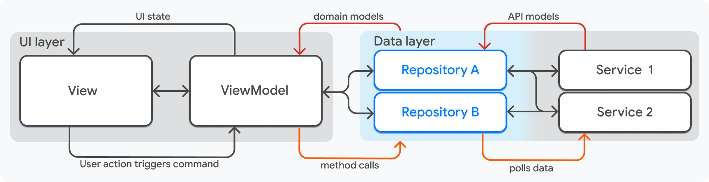

# Alfie Flutter 
This is a repository for an e-commerce Flutter app template. Its current behavior can be seen in the following demonstration:

<!-- TODO DEMONSTRATION VIDEO -->

## Prerequisites
1. This project uses a mock GraphQL API for fetching data. Mock server can be run locally as described in documentation: https://github.com/Mindera/Alfie-Mocks
2. This project uses two .env files: `.env.dev` and `.env.prod`. Both need a variable `GRAPHQL_SERVER` with a URL to the mock server.

## Setting Up the Project

1. Install Flutter and Dart on your machine. This repo uses the stable Flutter channel.
2. Create the environment files in `alfie_flutter/`:
   - `.env.dev`
   - `.env.prod`
3. Add the required GraphQL endpoint variable to both files:
   - `GRAPHQL_SERVER=<your-mock-server-url>`
4. From the repo root, install dependencies:
   - `cd alfie_flutter && flutter pub get`
5. Run the app locally with:
   - `cd alfie_flutter && flutter run`

## Architecture 

This project uses the MVVM architecture model as reccommended by the [Flutter Documentation](https://docs.flutter.dev/app-architecture/guide).

### View

- Can be composed by multiple widgets.
- Shouldn't have bussiness logic.
- Can have animation logic, simple routing logic, and if-else statements to choose wich widget to render.

### View Model

- Should serve the View with presentation ready domain data.
- Should expose methods for use of the view.

**Important Note:** Views and View Models must have a one-to-one relationship.

### Repositories 

- Repositories are the middleground between view models and services. 
- Should transform raw data into domain objects.
- Should expose methods that ease the access of data.

### Services

- Services are the entry point of the application.
- Should abstract external factors like APIs and Local files

  

_Note: For more detail go see the flutter documentation._

## GraphQL

This project relies on a mock GraphQL API for product and checkout data. You must run the mock server separately, as described in the [Alfie-Mocks documentation](https://github.com/Mindera/Alfie-Mocks).

The app reads the GraphQL endpoint from the `.env.dev` or `.env.prod` files via the `GRAPHQL_SERVER` variable.

GraphQL requests and responses are generated with GraphQL code generation. The generated models are not used directly across the app; instead, manual mappers convert those generated GraphQL DTOs into the apps domain models.

The mapper implementations live in `alfie_flutter/lib/graphql/extensions`, where generated GraphQL output is translated into the apps domain objects.

## CI/CD

The repository includes GitHub Actions workflows to validate code, run tests, and build release artifacts:

- `.github/workflows/ci.yaml`
  - Runs on push to non-main branches and on pull requests.
  - Calls the shared `test-and-lint` workflow.
- `.github/workflows/cd.yaml`
  - Runs on push to `main` and `release/**` branches.
  - Executes the same `test-and-lint` workflow first.
  - Runs integration tests for Android and iOS on supported runners.
  - Builds Android APK and iOS IPA/archive artifacts.

Shared workflow details:

- `.github/workflows/test-and-lint.yaml`
  - Checks out code and sets up Flutter.
  - Runs `flutter analyze` for static analysis.
  - Executes `alfie_flutter/test_coverage.sh` to run tests and generate coverage.
  - Optionally runs smoke integration tests on Android when enabled.
  - Uploads LCOV coverage reports as a PR message.

Helper action:

- `.github/actions/setup-env`
  - Sets up Flutter using the internal setup action.
  - Creates empty `.env.dev` and `.env.prod` files if required.
  - Runs `flutter pub get` in `alfie_flutter/`.

## Release

Release builds are handled through the CD workflow. Note that these artifacts represent "raw" builds; they are neither code-signed nor ready for production. The repository can produce:

- Android APK artifact: `alfie_flutter/build/app/outputs/flutter-apk/app-release.apk`
- iOS archive artifact: `alfie_flutter/build/ios/archive/Runner.xcarchive`

For local release builds, run:

- `cd alfie_flutter && flutter build apk --release`
- `cd alfie_flutter && flutter build ipa --release --no-codesign`

---